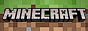

#  4JCraft — macOS Apple Silicon Port

     
   

---

4JCraft is a modified version of the Minecraft Console Legacy Edition, aimed at porting old Minecraft to different platforms. This fork adds **native macOS Apple Silicon (arm64)** support.

> [!NOTE]
> This fork was tested on **MacBook Air 13" M4 · 16 GB · 512 GB (2025)**. Other Apple Silicon Macs (M1–M4) should work as well. Intel Macs are untested.

---

## Building (macOS — Apple Silicon only)

### Prerequisites

#### 1. Xcode Command Line Tools

```bash
xcode-select --install
```

#### 2. Homebrew

If you don't have Homebrew installed:

```bash
/bin/bash -c "$(curl -fsSL https://raw.githubusercontent.com/Homebrew/install/HEAD/install.sh)"
```

#### 3. System Libraries

```bash
brew install sdl2 python3
```

#### 4. Meson + Ninja

Using a virtual environment (recommended):

```bash
python3 -m venv .venv
source .venv/bin/activate
pip install meson ninja
```

Or globally:

```bash
pip3 install meson ninja
```

---

### Configure & Build

```bash
# Activate venv if using one
source .venv/bin/activate

# Configure
meson setup build

# Compile
meson compile -C build
```

The binary is output to:

```
./build/targets/app/Minecraft.Client
```

#### Clean build

```bash
# Clean compiled objects only
meson compile --clean -C build

# Full reset
rm -rf ./build
meson setup build
```

---

## Running

Game assets are automatically copied to the build output directory during compilation. Run from that directory:

```bash
cd build/targets/app
./Minecraft.Client
```

The window title will show the current FPS and renderer info:

```
Minecraft Console Edition  |  60 FPS  |  GL 4.1 Metal  |  macOS arm64
```

---

## Controls (keyboard & mouse)

| Action | Key |
|---|---|
| Move | `W A S D` |
| Jump | `Space` |
| Sprint | `Left Ctrl` |
| Sneak | `Left Shift` |
| Attack / Break | `Enter` |
| Use / Place | `F` |
| Inventory | `E` |
| Crafting (2×2) | `C` |
| Drop item | `Q` |
| Pause menu | `Esc` |
| Third-person view | `F5` |
| Game info screen | `F3` |
| Hotbar slots | `1–9` |
| Camera | Mouse |

---

## Tested Hardware

| Device | Status |
|---|---|
| MacBook Air 13" M4 · 16 GB · 512 GB (2025) | ✅ Fully working |

Renderer: OpenGL 4.1 via Apple's Metal backend (`GL Version: 4.1 Metal`).

---

## Join the community

- **Discord:** https://discord.gg/zFCwRWkkUg
- **Steam:** https://steamcommunity.com/groups/4JCraft

---

### View the online documentation [here](https://4jcraft.github.io/4jcraft).

---

## Generative AI Policy

Submitting code to this repository authored by generative AI tools (LLMs, agentic coding tools, etc...) is strictly forbidden (see [CONTRIBUTING.md](./CONTRIBUTING.md)). Pull requests that are clearly vibe-coded or written by an LLM will be closed. Contributors are expected to both fully understand the code that they write **and** have the necessary skills to *maintain it*.
